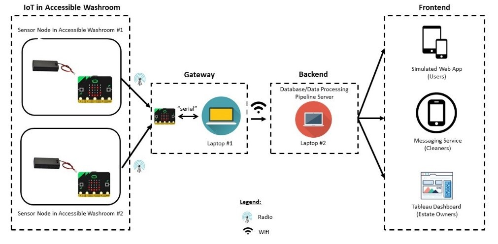

# Working Prototype for Accessible Washroom Occupancy Status & Usage Analysis 
This repository contains working code for an Internet of Things (IoT) system that aims to enhance the convenience, safety and cleanliness of accessible washrooms. 

The system integrates Micro:bit sensors (affixed on door locks) with backend systems to update various stakeholders on the live occupancy status of washrooms and sends alerts when there are incidents concerning safety and cleanliness.

A Tableau dashboard is also available to analyse the data collected from the smart washroom and optimise cleaning schedules.
# POC Architecture


# Components
Individual components are available in the respective files/folders:
* Micro:bit code for door lock sensors and serial communication to Gateway 
```
microbit/
```
* Gateway publisher
```
mqtt/src/gateway_publisher.py
```
* Backend subscriber & logic
```
mqtt/src/mqtt_subscriber.py
```
* MySQL database logical design
```
sql/
```
* Tableau Dashboards
```
dashboards/local
```
